# SpinAnalyzer v2

Villain pattern search engine for HU / Spin&Go poker.

```mermaid
flowchart LR
    RAW[Raw XML/TXT/PHH] --> PARSE[unified_parser]
    PARSE --> PHH[(PHH)]
    PHH --> PK[pokerkit_adapter<br/>GameState replay]
    PK --> EXT[extractor_v2]
    PK --> EVAL[hand_eval<br/>made/draws/blockers/equity]
    EVAL --> EXT
    EXT --> DP[(DPs parquet<br/>Hive partitioned)]
    DP --> AGG[aggregation<br/>stats/typology/sizing]
    DP --> VEC[vectorizer_v2<br/>99-dim]
    VEC --> FAISS[(FAISS HNSW<br/>per villain)]
    AGG --> PROFILES[(profiles.parquet)]
    DP --> API[FastAPI v2]
    FAISS --> API
    PROFILES --> API
    UPLOAD[POST /upload] --> ARQ[ARQ + Redis]
    ARQ -.runs.-> PARSE
    API --> WS[WS /jobs/&#123;id&#125;/stream]
    API --> FE[frontend-v2<br/>React + Vite]
    WS --> FE
```



## Quick start (full stack)

```bash
docker compose -f docker-compose.v2.yml up --build
```

Services:

- `redis` — broker for ARQ + WebSocket pub/sub
- `api` — FastAPI on `:8000` (`/api/v2/*`, `/docs`, `/openapi.json`)
- `worker` — ARQ worker that drains the upload queue
- `frontend` — Nginx-served SPA on `:3000`

Open <http://localhost:3000>, drop a `.xml` / `.zip` / `.phh` on the
**Upload** page, watch the live progress stream, then explore the
indexed villains.

## Local dev

### Backend

```bash
pip install -e ".[dev]"
docker compose -f docker-compose.dev.yml up -d redis     # Redis only
uvicorn src.api.v2.main:app --reload
arq src.workers.arq_worker.WorkerSettings &              # in another shell
```

### Frontend

```bash
cd frontend-v2
npm install
npm run dev               # http://localhost:5173 (proxies /api to :8000)
npm run gen-api           # regenerate api-types.ts from /openapi.json
```

### Tests

```bash
# Backend
pytest tests/unit tests/integration -q
pytest --cov --cov-report=term --cov-config=pyproject.toml

# Frontend
cd frontend-v2
npm run test              # Vitest unit
npm run e2e               # Playwright (boots dev server)
```

### Performance benchmark

```bash
python scripts/benchmark.py --xml-sample 50 --queries 200
```

## What v2 changed vs v1

The v1 pipeline had three bugs that flattened the search space:

1. `_group_actions_by_street` dumped every action into the `preflop`
   bucket. v2 reads the native PHH `street` field per action and
   cross-validates it with PokerKit's `street_index`.
2. `_extract_villain_hand_info` always returned `(None, None, None)`.
   v2 scans `event="cards"` rows for the villain name and projects the
   holding retroactively across every step (made / draws / blockers /
   equity per step).
3. `_extract_board_by_street` read a top-level `phh['board']` field
   that doesn't exist in this format. v2 reconstructs the board from
   the `event="cards"` rows in the action stream.

Validated against the 134-PHH zip:

- 250 DPs (vs 0 postflop in v1): 135 PF / 62 F / 29 T / 24 R
- 86/86 revealed-DPs have `hand_strength` populated (was 100% NULL)
- 115/115 postflop DPs have board cards (was 0%)

## Layout

```
src/
├── parsers/                 PHH ingest (XML/TXT/ZIP) + PokerKit adapter
├── context/                 extractor v2 + street/path/line tagging
├── hand_eval/               evaluator + made_hand + draws + blockers + equity
├── intent/                  rule-based value/bluff/semi/catcher classifier
├── aggregation/             villain stats + typology + fingerprints + sizing
├── vectorization/           99-dim vectorizer (reuses v1 encoders)
├── indexing/                FAISS HNSW per villain
├── services/                cache (Redis) + ETL pipeline orchestrator
├── workers/                 ARQ tasks
├── api/v2/                  FastAPI v2 (DI, routers, OpenAPI)
└── api/legacy/              v1 modules preserved as fallback
frontend-v2/                 Vite + React + TS + Tailwind + TanStack
tests/                       unit + integration
scripts/benchmark.py         perf benchmark script
docker-compose.v2.yml        full-stack deployment
docker-compose.dev.yml       Redis-only for local dev
```

## API

| Endpoint | Purpose |
|---|---|
| `GET /api/v2/health` | service status + counts |
| `GET /api/v2/villains` | list villains + archetype + summary stats |
| `GET /api/v2/villains/{name}` | full stats profile |
| `GET /api/v2/villains/{name}/sizing` | bet-size histograms |
| `GET /api/v2/hands/{hand_id}` | all DPs for a hand |
| `GET /api/v2/decisions/{decision_id}` | one DP |
| `POST /api/v2/search/by-decision` | k-NN via FAISS around an existing DP |
| `POST /api/v2/search/by-action-path` | exact filter on (villain, street, path) |
| `POST /api/v2/search/by-spot-builder` | k-NN around a synthesised DP (Mode A) |
| `POST /api/v2/upload` | multipart upload → ARQ pipeline (sync fallback if Redis down) |
| `GET /api/v2/jobs/{id}` | ARQ job state |
| `WS /api/v2/jobs/{id}/stream` | live progress events |

## Status

- **Backend** complete: parsers, hand eval, extractor, aggregation,
  vectorizer, FAISS, API v2, ARQ workers, CI workflow.
- **Frontend** scaffolded: Dashboard, villain list/profile, hand
  replayer, three search modes (by-decision / by-action-path / spot
  builder), upload with WebSocket progress. Browser-side verification
  still pending.
- **Coverage** target: backend ≥75% (gate enforced via `pytest --cov`).

## Known gaps / next steps

- `routeTree.gen.ts` is hand-written; switch to `@tanstack/router-plugin`
  when adopting their codegen.
- Mode B (paste hand text → parse → DP picker) deferred to v3.
- Bayesian DP-unknown range, recent-hand context features, k-means
  typology — deferred to v3.
- Qdrant migration when DPs > 500k.
